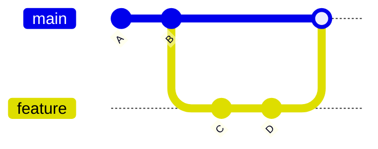

# What Git?
プロジェクトの変更を追跡したり、同じプロジェクトを複数のユーザーが
共同作業できるようにしたテクノロジー。


１つのフォルダとその中に含まれるファイルで構成され、変更が加えられると
Gitは追跡をする。

自身が行なっている作業をのバージョンを保存することができる。Gitがバージョン
管理システムと呼ばれるのはそのため。

## Gitの４つの領域
操作をするときに意識しておく領域

- 作業ディレクトリ
- ステージングエリア
- コミット履歴
- ローカルリポジトリ

### 作業ディレクトリ
１つのバージョンを表すファイルとディレクトリが含まれている。

### ステージングエリア
staging areaとは下書きスペースのようなものでありコミットに含めたい
ファイルを追加したり取り消す場所。

### コミットとは何？
１つのバージョン。プロジェクトのスナップショットと考える。
全てのコミットは、コミットハッシュ（commit hash）を待つ。英数字で
構成される40文字の一意のハッシュ値であり、コミットIDと呼ばれることが
ある。

```shell
hashimotojunichi@hashimotojunichinoMac-mini trygopher % git log          
commit c02ea5a3f8a2b3552b042d0edd7846fff7f1831b (HEAD -> basic1-sub1, origin/basic1, basic1)
```

### ローカルリポジトリ

```mermaid
erDiagram
    ローカルリポジトリ ||--|| ステージングエリア(index) : contains
    ローカルリポジトリ ||--|| コミット履歴(objects) : contains
```

### ブランチについて
主要ブランチ、メインブランチ、プライマリーブランチを１つ持っていて、そこから分岐して、
topic branchまたは、feature branchと呼ばれる新機能ブランチを作成する。

機能ブランチをfeature branch
一時的な作業で、機能追加・バグ修正するのをtopic branchと呼ぶ。

### Gitのブランチとは正確には何か？
コミットを指す移動可能なポインターと表現される。

### 未変更ファイルと変更済みファイル
作業ディレクトリの追跡ずみファイルには、２つの状態ののうちいずれかがある。

未変更ファイル(unmodified file)は、最後のコミット以降に変更されていないファイル。
作業ディレクトリ内のファイルが編集され、保存されると、変更済みファイル(
modified file)になる。

### What HEAD?
ある特定のコミットを指している特定のブランチ上にいることになり、ユーザーが
どのブランチにいるのか教えてくれる単なるポインター。

### ブランチの切り替えと作成

git switch -c <new_branch_name>
新しいブランチを作成し、それに切り替える

git checkout -b <new_branch_name>
新しいブランチを作成し、それに切り替える

### マージの種類

## fast-forwardマージとは
fast-forwardマージは、Gitでブランチをマージする際の特殊なケースです。これは、マージ先のブランチ（例：ブランチ）に、マージ元のブランチ（例：`feature`ブランチ）が分岐してから新たなコミットが存在しない場合に発生します。 `main`
言い換えると、マージ元のブランチの履歴が、マージ先のブランチの履歴を完全に含んでおり、その延長線上にある状態です。
この状況では、Gitは新しいマージコミットを作成する必要がありません。代わりに、マージ先のブランチのポインタ（HEAD）を、マージ元のブランチの最新のコミットに単純に「早送り（fast-forward）」させるだけです。
**特徴：**
- **マージコミットが作成されない**: 履歴が直線的になり、ブランチがどこでマージされたかの情報が明示的には残りません。
- **履歴がシンプル**: プロジェクトの履歴が分岐とマージで複雑になるのを防ぎ、一直線に保つことができます。
- **デフォルトの動作**: この条件を満たす場合、Gitはデフォルトでfast-forwardマージを試みます。

## Mermaidによる図解
以下にfast-forwardマージの概念をMermaidの`gitGraph`で示します。


**図の説明：**
1. ブランチはコミット`A`から`B`へと進んでいます。 `main`
2. ブランチのコミット`B`から`feature`ブランチが分岐し、コミット`C`、`D`が追加されます。 `main`
3. この間、ブランチには新しいコミットがありません（`B`のままです）。 `main`
4. この状態でブランチに`feature`ブランチをマージすると、ブランチのポインタが`feature`ブランチの最新コミット`D`に直接移動します。新しいマージコミットは作成されません。 `main``main`

結果として、ブランチの履歴は`A` -> `B` -> `C` -> `D`となり、あたかも`C`と`D`が直接ブランチで行われたかのような直線的な履歴になります。 `main``main`
fast-forwardマージを避け、必ずマージコミットを作成したい場合は、`git merge --no-ff <branch-name>` コマンドを使用します。これにより、ブランチがマージされたという事実を履歴に明示的に残すことができます。


## 3-wayマージとは
3-wayマージは、Gitなどのバージョン管理システムで、異なるブランチに加えられた変更を統合する際の基本的なマージ戦略です。名前の通り、このマージ方法では**3つのコミット**が参照されます。
1. **共通の祖先コミット**: マージ対象の2つのブランチが分岐する前の、共通のコミット。これを仮に「コミット③」とします。
2. **一方のブランチの最新コミット**: 一方のブランチ（例：featureブランチ）で行われた最新の変更。これを仮に「コミット①」とします。
3. **もう一方のブランチの最新コミット**: もう一方のブランチ（例：mainブランチ）で行われた最新の変更。これを仮に「コミット②」とします。

Gitはこれらの3つのコミットを比較します。 具体的には、
- 「コミット①とコミット③の差分」（featureブランチで行われた変更）
- 「コミット②とコミット③の差分」（mainブランチで行われた変更） をそれぞれ特定します。

そして、これらの両方の差分（変更点）を現在のブランチ（マージ先のブランチ）に取り込み、新しい**マージコミット**を作成します。これにより、両方のブランチの作業内容が統合されます。
## Mermaidによる図解
以下に3-wayマージの概念をMermaidの`gitGraph`で示します。

```mermaid
gitGraph
    commit id: "③ 共通祖先"
    branch feature
    branch main
    checkout feature
    commit id: "① featureの変更"
    checkout main
    commit id: "② mainの変更"
    checkout main
    merge feature id: "マージコミット"

```

**図の説明：**
- `③ 共通祖先`: 2つのブランチが分岐する前のコミットです。
- `feature`ブランチが分岐し、`① featureの変更`というコミットが追加されます。
- ブランチも`③ 共通祖先`から分岐し、`② mainの変更`というコミットが追加されます。 `main`
- ブランチに`feature`ブランチをマージすると、Gitは`③ 共通祖先`、`① featureの変更`、`② mainの変更`の3つを比較し、両方の変更を取り込んだ新しい`マージコミット`をブランチに作成します。 `main``main`